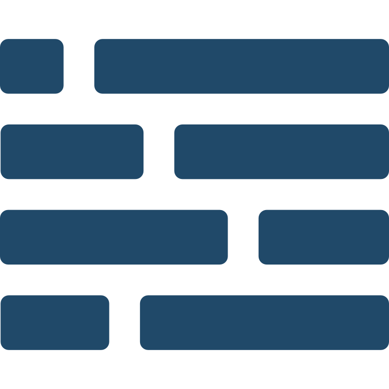

<p align="center"></p>
<h1 align="center">lyt</h1>
<div align="center">

  [](https://github.com/ColinEspinas/lyt)
  [](https://github.com/ColinEspinas/lyt/blob/master/LICENSE)
  [](https://github.com/ColinEspinas/lyt/issues)

</div>

<p align="center">
A flexible and highly configurable CSS layout library. Designed to be tweaked.
<br />
<!-- <a href=""><strong>Check out the docs »</strong></a> -->
<br>
<a href="https://github.com/ColinEspinas/lyt/issues" target="_blank">Request Feature</a>
/
<a href="https://github.com/ColinEspinas/lyt/issues" target="_blank">Report a Bug</a>
</p>

## Getting started

### 🚀 Import using a CDN

Just link the `lyt.css` file or it minified version.

```html
<!-- Use normal or minified -->
<link rel="stylesheet" href="https://cdn.jsdelivr.net/gh/ColinEspinas/lyt/dist/lyt.css">
<link rel="stylesheet" href="https://cdn.jsdelivr.net/gh/ColinEspinas/lyt/dist/lyt.min.css">
```

You can also use each modules individually.

```html
<!-- Use normal or minified -->
<link rel="stylesheet" href="path/to/lyt/dist/grid/flex.css">
<link rel="stylesheet" href="path/to/lyt/dist/grid/flex.min.css">
```

### ⚙️ Configure

Lyt is designed to be easily configurable using `scss`.

When using a CDN or local download, you can import the `scss` files by loading them from the `/scss` directory.

```scss
@import "path/to/lyt/scss/lyt.scss";
/* Or using individual modules */
@import "path/to/lyt/scss/grid/flex.scss";
```

Then you just need to import your configuration file before you import the lyt module files.

```scss
@import "path/to/config";
@import "path/to/lyt/scss/lyt.scss";
```

You can find a template config file where all variables are commented with the default values in `/scss/_config.scss`. This configuration file is the default configuration, it is imported by default when building the library.

## Modules

Lyt is build from multiple modules:

- [Grid](#grid)
  - [Flex](#flex)
- [Utilities](#utilities)
  - [Margin](#margin)
  - [Padding](#padding)

**All the documentation use the default configuration**

### Grid

#### Flex

Used to manage the layout easily, the flex grid uses a classic system of row and columns and can be fully customized.

Create rows and columns using `row` and `column`.

By default columns take 100% of the available width. You can constraint a column width by using the `-n` class (n being the amount of space out of 12 taken by the column).

Add the `gap` class to a row to add gaps between columns.

```html
<div class="row gap">
    <div class="column -6">
        <p class="padding-m box">6 of 12</p>
    </div>
    <div class="column -6">
        <p class="padding-m box">6 of 12</p>
    </div>
</div>
```
[See example live](https://jsfiddle.net/hpax1ksL/)

You can also specify a breakpoint to a column by using the `breakpoint-n` class instead (e.g. `sm-5`).

By specifying multiple breakpoints to a column, the column will adapt automatically.

```html
<div class="row gap">
    <div class="column sm-10 md-2">
        <p class="padding-m box"></p>
    </div>
    <div class="column sm-2 md-10">
        <p class="padding-m box"></p>
    </div>
</div>
```
[See example live](https://jsfiddle.net/ogarwz7v/)

You can offset columns by using the `offset-n` class. You can also specify breakpoints by using the `offset-breakpoint-n` class.

```html
<div class="row ">
	<div class="column sm-10 offset-sm-1 md-6 offset-md-3">
		<p class="padding-m box">Centered column</p>
	</div>
</div>
```
[See example live](https://jsfiddle.net/sr2c0w96/)

### Utilities

#### Margin

Use the `margin-size` class to add a margin to an element (`size` is the name of the value to the margin).

```html
<p class="margin-m">I am a funny text.</p>
```

Default configuration uses the following values for margin:
| Name | Value |
|------|-------|
| xs   | 4px   |
| s    | 8px   |
| m    | 16px  |
| l    | 24px  |
| xl   | 32px  |
| xxl  | 40px  |

By default, the margin value is applied to all sides. You can specify a location for the margin with `margin-location-size` (e.g. `margin-t-xl`).

To specify a location use:
| Name | Location       |
|------|----------------|
| t    | top            |
| l    | left           |
| b    | bottom         |
| r    | right          |
| tb   | top and bottom |
| lr   | left and right |

#### Padding

Padding classes are used like margin classes but add padding instead.

```html
<p class="padding-t-xxl">I am super cool!<p>
```